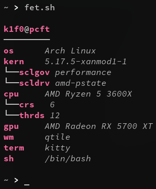

<h1>fet.sh-fork by k1f0</h1>
modified/tweaked, mostly based on personal preference
 

## Installation
Copy `fet.sh` to somewhere in $PATH and mark it as executable (`chmod +x fet.sh`)

## Added:
- GPU-Info
- Extended Kernel Info
- Extended CPU Info

## Removed:
- FreeBSD/MacOS Support (mainly for code reduction)
